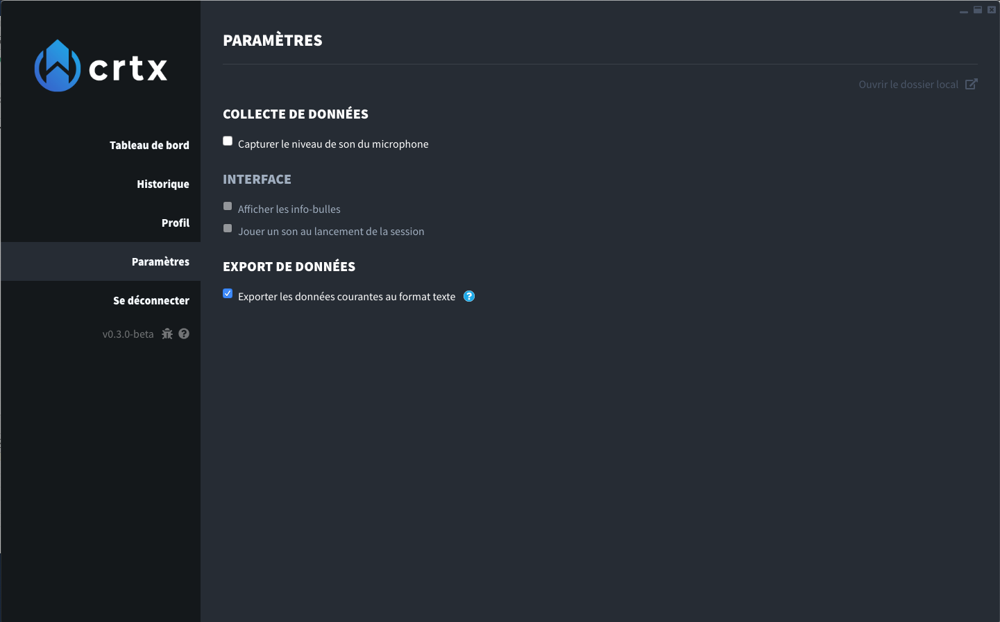

# Export Cortex live data

### Enabling Data Export

Cortex can export its live data in text files, so you can use them in another app.

From the SETTINGS page in the application, make sure you checked the corresponding setting.

You can then click on "Open local data folder" : you will see a bunch of text files, each containing the current value of a Cortex metric.

### Using exported data in OBS

...Coming soon !

