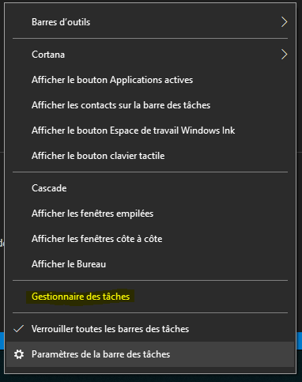
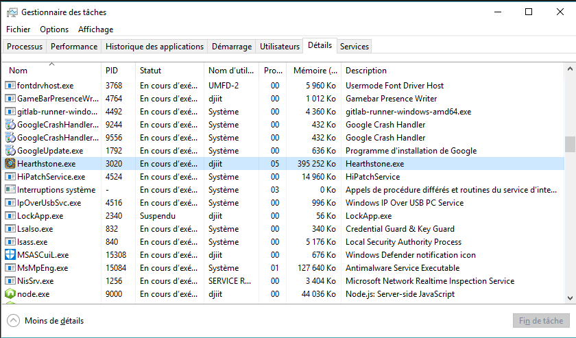

# Game Detection

## Detecting your favorite game

To detect your favorite game, Cortex need to know its process name \([Discord uses a similar technique](https://support.discordapp.com/hc/fr/articles/217960107-D%C3%A9tection-de-jeu-101?flash_digest=2b9dfd5c09e5aced9ee4abae2d5c01f0c6f9a125)\). You can help us detect more games by following this little guide. **Your contributions really matter to us; let's make Cortex smarter together !**

1. Start your game \(no surprises here\).

2. Open your process manager by right-clicking on your toolbar : 

   

3. Go to the "**Details**" view and note the process name of the game, here "**Hearthstone.exe**"

  

   

4. Send an email to [support@crtx.gg](mailto:support@crtx.gg) \(or [reach us on Discord](https://invite.gg/crtx)\) with this information; we will include this in our next release so Cortex can detect the game !

5. Thanks a lot ! Cortex is now a bit smarter.

