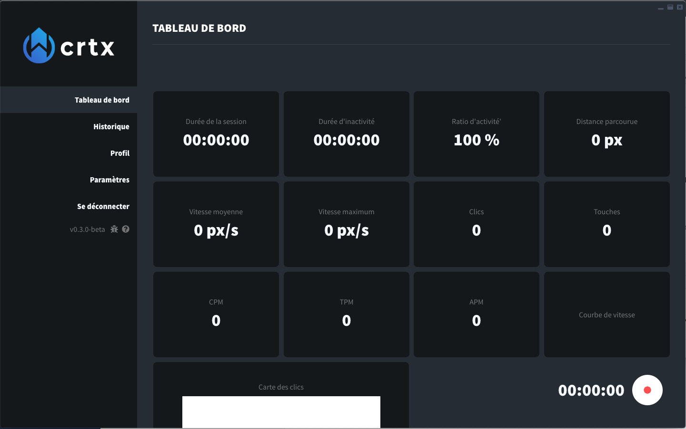
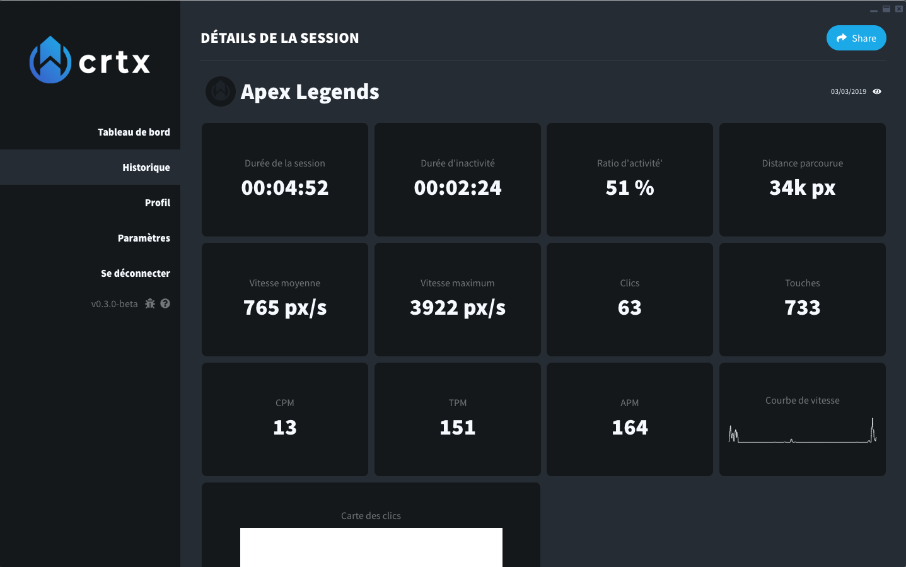

# Usage

Using Cortex should be straightforward. Open the application, create your account and you'll see your Dashboard.

From here, simply start a session by clicking on the RECORD button at the bottom-right of the application. You can now start your favorite game, and Cortex will record your performances.

Click on it again to stop the session, and you'll be taken to a recap screen with all your collected data.

